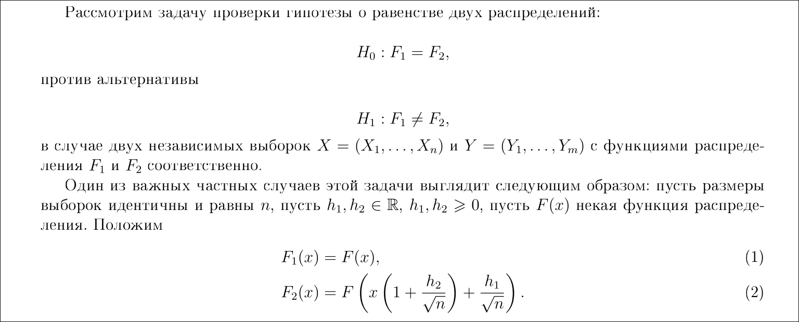
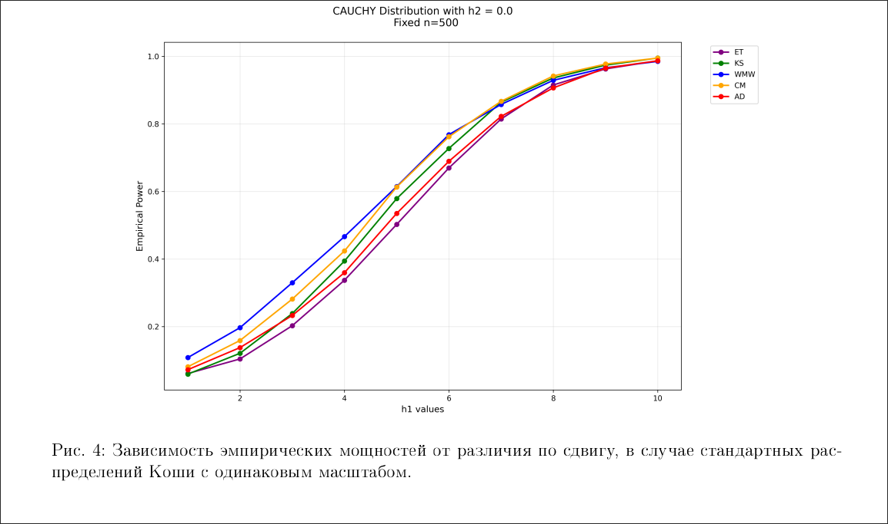
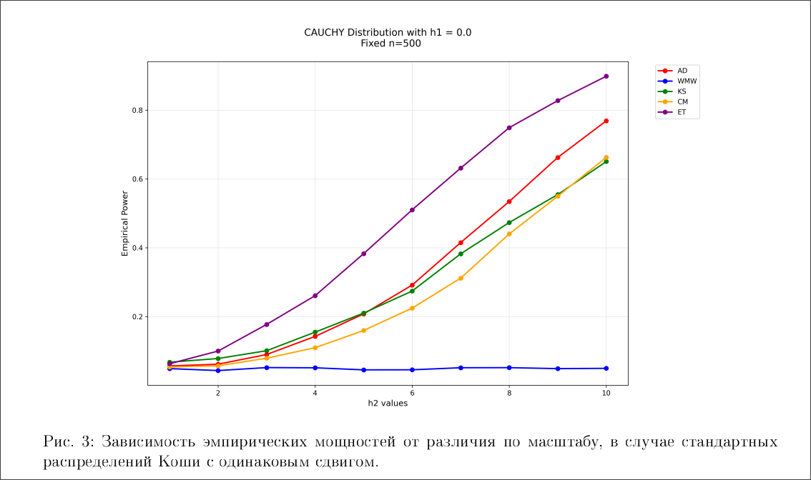

# On the asymptotic power of the Energy test

### !!! Смотри файл ./report.pdf !!!

В общем и целом, рассматривается гипотеза о равенстве двух распределений.  
Рассматривается location-scale модель.

Существует какое-то количество довольно широкоизвестных тестов "заточенных" под эту ситуацию.

В данной работе был проведён анализ мощностей какого-то количества тестов. 

Также, особое внимание было уделено мощности энерегического теста.  
[В работе В.Б.Меласа](https://doi.org/10.21638/spbu01.2024.304)
было найдено предельное распределение для статистики энергетического теста
при H0 и при H1, была получена формула для асимптотической мощности.

С помощью моделирования было установлено при каких размерах выборки
асимптотическая мощность хорошо приближает эмпирические.  

Было показано, что в случае отличия распределений по масштабу,
энергетический тест оказывается наиболее мощным среди всех рассмотренных.

Вырезка из pdf-ки с обозначениями:

Вот парочка графиков вырезанных из pdf-ки:

